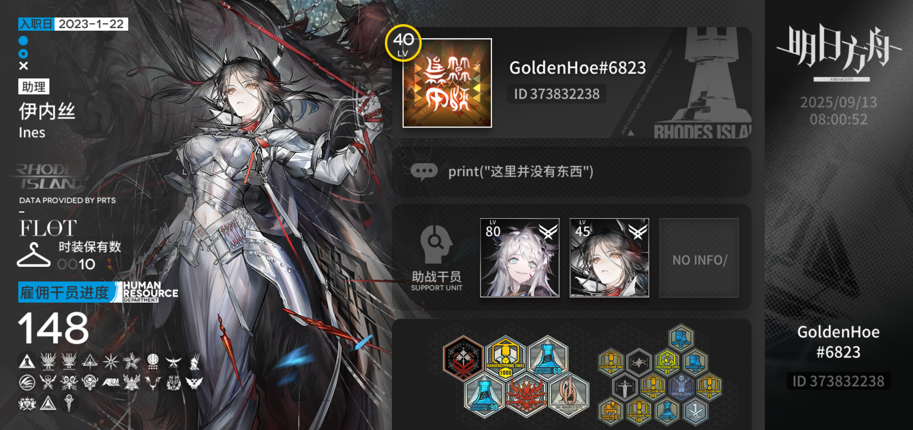

  <h1>Hi!🤗 I'm Golden_Hoe</h1>
  <h5>高三学生、业余Python/Kotlin开发者，在开源社区享有“GoldenHoe是谁啊没听说过”的盛名。</h5>
  <h3>♿冲刺♿冲刺♿冲</h3>
  

>[!Warning]
>本人不定时发疯(鉴定过，是假的  
>

### 《肺雾》

### 年龄

### 性别
>男
### 居住地🌏
>蜀地四水汇流之处，天府之芯，锦城是也。  
### 成分😎
#### 技术栈
**语言**  
  

正在学习   
  

**库**  

#### 开发工具
**IDEs**  
  

### 你能在什么地方找到随机出现的Golden_Hoe
>Bilibili(Golden_Hoe)
>
>X(@Leo167120)
>
>Instagram(@goldenhoelee)
>
>Discord(@shiroko1024)

## 顺带一提
给我玩明日方舟😡🫵

## My GnuPG Public Key
FINGERPRINT: 4900 8F79 0CDB B34E C1D2  6A82 CE50 A883 DE74 5329    
FILE: [GoldenHoe_pub.asc](./gpg-pubkey/GoldenHoe_pub.asc)
<!---
GoldenHoe/GoldenHoe is a ✨ special ✨ repository because its `README.md` (this file) appears on your GitHub profile.
You can click the Preview link to take a look at your changes.
--->
